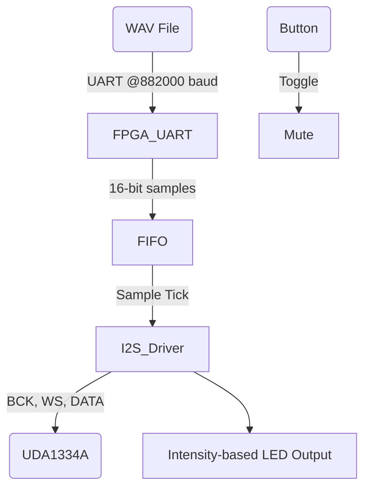

# 🎵 FPGA-AudioStream: Real-Time Audio Playback over UART to I2S DAC

A lightweight, low-latency FPGA-based audio streaming pipeline that transmits 16-bit 44.1kHz WAV files from a PC to an I2S DAC via UART. Designed for platforms like the **Tang Nano 9K** and compatible with DACs like the **UDA1334A**, this system demonstrates real-time audio streaming with precise timing and buffering.

---

## 📦 Features

- ✅ UART-based audio transmission from PC (16-bit 44.1kHz WAV)
- ✅ FIFO buffering to decouple UART and DAC timing
- ✅ Real-time I2S output using bit-precise Verilog driver
- ✅ Smooth LED VU meter showing audio intensity
- ✅ Button-controlled mute functionality
- ✅ Compatible with UDA1334A and similar DACs
- ✅ No external memory or OS required—fully RTL

---

## 📁 Project Structure

```
├── uart.v         # UART receiver with byte pair to 16-bit sample logic + LED VU meter
├── FIFO.v         # 256-sample FIFO to handle UART/DAC rate mismatch
├── driver.v       # I2S driver: generates BCK, WS, DATA and supports mute toggle
├── stream_audio.py# Python script to send WAV files via UART from PC
├── README.md      # This file
```

---

## 🧠 System Overview



---

## 🛠️ Requirements

### 🖥️ PC Side
- Python 3.x
- `pyserial` package
- 16-bit mono 44.1kHz `.wav` audio file

Install dependencies:
```bash
pip install pyserial
```

### 🧠 FPGA Side
- Gowin FPGA board (e.g., Tang Nano 9K)
- UDA1334A or similar I2S DAC
- UART connected to PC (FTDI, CP2102, etc.)
- Audio output (e.g., speakers or amp)

---

## 🚀 Usage

### 1. Flash your FPGA with the synthesized bitstream built from `uart.v`, `FIFO.v`, and `driver.v`.

### 2. Connect the UART port to your PC (FTDI/USB-UART adapter).

### 3. Run the Python streaming tool:

```bash
python3 stream_audio.py my_audio.wav --port /dev/ttyUSB1
```

> **Looping mode**:
```bash
python3 stream_audio.py my_audio.wav --port /dev/ttyUSB1 --loop
```

### 4. Press BTN1 on FPGA to toggle mute.

---

## 🎚️ Audio Scaling Logic

The Python script uses fixed-point volume control before transmission:
```python
scaled_sample = (sample * scale + 128) >> 8
```
This avoids float ops, maintains dynamic range, and fits resource-constrained designs.
You may try in different FPGAs as well
---

## 💡 Tips

- Match `DELAY_FRAMES` carefully based on UART baud and FPGA clock. For 882000 baud on 27 MHz, `DELAY_FRAMES ≈ 31`.
- Ensure no overflow in FIFO: avoid mismatch in `sample_tick` vs UART arrival rate.
- Use the onboard LED pattern as a visual volume monitor.
- The `mute` logic uses rising edge detection of BTN1 for toggling.

---

## 📈 Performance

| Metric        | Value             |
|---------------|------------------|
| Audio Format  | 16-bit Mono WAV  |
| Sample Rate   | 44.1 kHz         |
| UART Baud     | 882000           |
| FIFO Depth    | 256 Samples      |
| Output Format | I2S, 16-bit stereo (duplicated mono) |
| DAC Tested    | UDA1334A         |

---

## 📃 License

This project is released under the MIT License.

---

## 🙋 Acknowledgements

- Verilog logic inspired by open-source UART and I2S implementations
- Python fixed-point scaling adapted for embedded streaming
